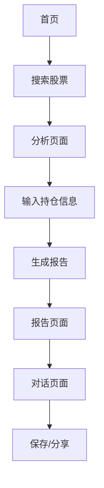

## 1. 产品概述
股票分析系统是一个专业的金融分析工具，用户通过输入股票名称和持仓情况，获取全面的技术面和消息面分析报告。系统旨在帮助投资者做出更明智的投资决策，提供实时、准确的股票分析服务。

目标用户包括个人投资者、股票分析师和金融机构，通过AI驱动的分析引擎提供专业的投资建议和风险评估。

## 2. 核心功能

### 2.1 用户角色
| 角色 | 注册方式 | 核心权限 |
|------|----------|----------|
| 普通用户 | 邮箱注册 | 基础股票分析、查看报告 |
| 高级用户 | 付费升级 | 高级分析报告、历史记录、自定义指标 |

### 2.2 功能模块
股票分析系统包含以下主要页面：
1. **首页**: 股票搜索、热门股票展示、快速分析入口
2. **分析页面**: 股票信息输入、持仓配置、分析报告生成
3. **报告页面**: 技术分析、消息面分析、投资建议展示
4. **对话页面**: AI交互、问题解答、深度分析

### 2.3 页面详情
| 页面名称 | 模块名称 | 功能描述 |
|----------|----------|----------|
| 首页 | 搜索模块 | 输入股票代码或名称进行搜索，支持模糊匹配 |
| 首页 | 热门股票 | 展示市场热门股票和涨跌幅排行榜 |
| 首页 | 快速入口 | 提供快捷分析入口和历史记录查看 |
| 分析页面 | 股票信息 | 显示股票基本信息、实时价格、涨跌幅 |
| 分析页面 | 持仓输入 | 输入持仓数量、成本价、持仓时间 |
| 分析页面 | 分析类型 | 选择技术分析、基本面分析或综合分析 |
| 分析页面 | 生成报告 | 点击生成详细的股票分析报告 |
| 报告页面 | 技术分析 | 展示K线图、均线、MACD、RSI等技术指标 |
| 报告页面 | 消息面分析 | 展示相关新闻、公告、研报等资讯 |
| 报告页面 | 投资建议 | 提供买入、持有、卖出建议和风险提示 |
| 报告页面 | 交互功能 | 支持报告分享、下载、收藏 |
| 对话页面 | AI助手 | 与AI进行对话，询问股票相关问题 |
| 对话页面 | 历史记录 | 查看历史对话记录和分析报告 |
| 对话页面 | 智能推荐 | 基于用户偏好推荐相关股票 |

## 3. 核心流程
用户操作流程如下：
1. 用户进入首页，搜索目标股票
2. 输入持仓信息（可选）
3. 选择分析类型并生成报告
4. 查看详细的分析报告
5. 与AI助手进行深度交互
6. 保存或分享分析报告

## 4. 用户界面设计

### 4.1 设计风格
- **主色调**: 深蓝色（#1e3a8a）和绿色（#059669）体现专业性
- **辅助色**: 灰色系（#6b7280, #9ca3af）用于背景和文字
- **按钮样式**: 圆角矩形，主要操作为实心背景，次要操作为边框样式
- **字体**: 中文使用PingFang SC，英文使用Inter，标题18-24px，正文14-16px
- **布局风格**: 卡片式布局，左侧导航，右侧内容区域
- **图标风格**: 使用线性图标，简洁现代的设计风格

### 4.2 页面设计概述
| 页面名称 | 模块名称 | UI元素 |
|----------|----------|--------|
| 首页 | 搜索模块 | 居中搜索框，蓝色边框，搜索图标，实时搜索建议下拉列表 |
| 首页 | 热门股票 | 卡片网格布局，每卡显示股票名称、价格、涨跌幅，红绿颜色区分涨跌 |
| 分析页面 | 股票信息 | 顶部横幅显示股票名称和实时数据，使用大号字体和醒目颜色 |
| 分析页面 | 持仓输入 | 表单输入框，标签清晰，支持快速输入和验证 |
| 报告页面 | 技术分析 | 全屏图表展示，支持缩放和交互，技术指标清晰标注 |
| 报告页面 | 投资建议 | 醒目标签显示建议等级，配以文字说明和风险提示 |
| 对话页面 | AI助手 | 聊天式界面，用户输入在左，AI回复在右，支持markdown渲染 |

### 4.3 响应式设计
- **桌面优先**: 主要针对1920x1080分辨率优化
- **平板适配**: 768px以上设备显示完整功能
- **手机适配**: 支持375px以上移动设备，采用垂直布局
- **触摸优化**: 按钮最小44px，支持手势操作