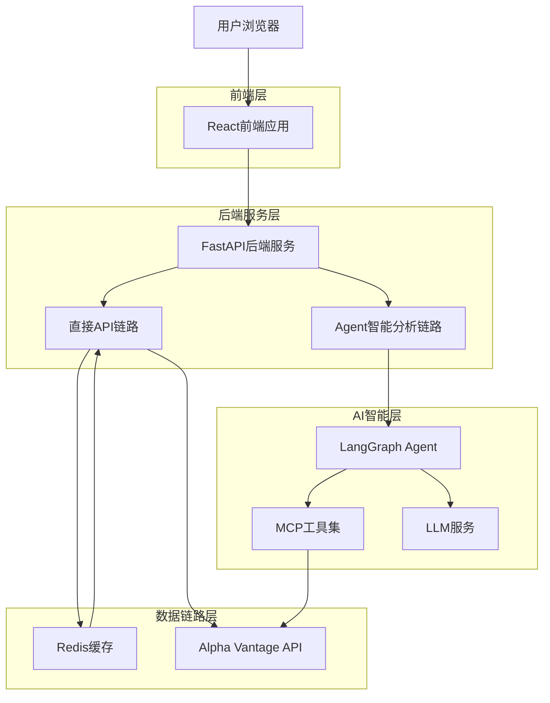
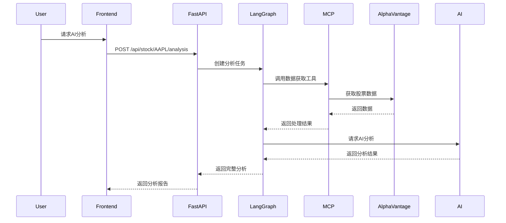

## 1. 架构设计

### 1.1 双链路架构概览


### 1.2 双链路详细设计

**直接API链路（高速通道）**:
- 用途：快速获取基础股票数据，低延迟响应
- 路径：Python后端 → Redis缓存 → Alpha Vantage API
- 特点：简单直接、高性能、适合实时数据获取

**Agent智能分析链路（智能通道）**:
- 用途：复杂多步骤分析，结合多维度数据
- 路径：Python后端 → LangGraph Agent → MCP工具 → Alpha Vantage API → LLM分析
- 特点：智能化、可编排、适合深度分析

## 2. 技术栈描述

- **前端**: React@18 + TypeScript@5 + Tailwind CSS@3 + Vite
- **后端**: FastAPI@0.104 + Python@3.11
- **缓存**: Redis@7
- **AI框架**: LangGraph + LangChain
- **API调用**: httpx@0.25
- **数据格式**: Pandas@2 + NumPy@1.24
- **部署**: Docker + Uvicorn

## 3. 路由定义

### 3.1 直接API链路端点（高速通道）
| 路由 | 用途 | 响应时间 |
|-------|---------|----------|
| /api/stock/{symbol}/data | 获取股票实时数据 | < 200ms |
| /api/stock/{symbol}/technical | 获取技术分析指标 | < 300ms |
| /api/stock/{symbol}/price | 获取当前价格 | < 100ms |
| /api/stock/{symbol}/history | 获取历史数据 | < 500ms |

### 3.2 Agent智能分析链路端点（智能通道）
| 路由 | 用途 | 处理时间 |
|-------|---------|----------|
| /api/stock/{symbol}/analysis | 综合智能分析 | 5-15秒 |
| /api/stock/{symbol}/strategy | 投资策略建议 | 8-20秒 |
| /api/stock/{symbol}/report | 生成投资报告 | 10-30秒 |
| /api/analysis/status/{task_id} | 查询分析任务状态 | < 100ms |

### 3.3 系统管理端点
| 路由 | 用途 |
|-------|---------|
| /api/cache/clear | 清理缓存 |
| /api/system/status | 系统状态监控 |
| /health | 健康检查 |

## 4. 双链路核心实现

### 4.1 链路选择策略
```python
class LinkageRouter:
    """双链路路由器"""
    
    def __init__(self):
        self.direct_link = DirectAPILink()
        self.agent_link = AgentAnalysisLink()
    
    async def route_request(self, symbol: str, request_type: str, params: dict) -> dict:
        """根据请求类型智能选择链路"""
        
        # 高速数据获取 - 使用直接API链路
        if request_type in ['price', 'quote', 'intraday']:
            return await self.direct_link.get_real_time_data(symbol, params)
        
        # 复杂分析 - 使用Agent智能链路
        elif request_type in ['analysis', 'strategy', 'report']:
            return await self.agent_link.get_intelligent_analysis(symbol, params)
        
        # 技术指标 - 根据复杂度选择
        elif request_type == 'technical':
            indicators = params.get('indicators', [])
            if len(indicators) <= 3:  # 简单指标，用直接链路
                return await self.direct_link.get_technical_indicators(symbol, params)
            else:  # 复杂指标组合，用Agent链路
                return await self.agent_link.get_advanced_analysis(symbol, params)
        
        # 默认使用直接链路
        else:
            return await self.direct_link.get_basic_data(symbol, params)
```

### 4.2 直接API链路（高速通道）
```mermaid
sequenceDiagram
    participant User
    participant Frontend
    participant FastAPI
    participant Redis
    participant AlphaVantage

    User->>Frontend: 请求股票数据
    Frontend->>FastAPI: GET /api/stock/AAPL/data
    FastAPI->>Redis: 检查缓存
    alt 缓存命中
        Redis-->>FastAPI: 返回缓存数据
    else 缓存未命中
        FastAPI->>AlphaVantage: 调用API
        AlphaVantage-->>FastAPI: 返回实时数据
        FastAPI->>Redis: 缓存数据(5分钟TTL)
    end
    FastAPI-->>Frontend: 返回数据
    Frontend-->>User: 显示结果

### 4.5 Agent智能链路核心实现
```python
class AgentAnalysisLink:
    """Agent智能分析链路 - 智能通道"""
    
    def __init__(self):
        self.langgraph_agent = StockAnalysisAgent()
        self.task_manager = TaskManager()
        self.mcp_tools = AlphaVantageMCP()
    
    async def get_intelligent_analysis(self, symbol: str, params: dict) -> dict:
        """获取智能分析 - 目标处理时间 5-15秒"""
        
        # 1. 创建异步任务
        task = self.task_manager.create_task(symbol, "comprehensive_analysis")
        
        # 2. 启动LangGraph工作流
        workflow_input = {
            "symbol": symbol,
            "analysis_type": params.get("type", "comprehensive"),
            "include_news": params.get("include_news", True),
            "time_horizon": params.get("time_horizon", "medium_term"),
            "task_id": task.id
        }
        
        # 3. 异步执行分析流程
        asyncio.create_task(self._run_analysis_workflow(workflow_input))
        
        # 4. 立即返回任务ID，前端可以轮询状态
        return {
            "task_id": task.id,
            "status": "processing",
            "estimated_time": "5-15 seconds",
            "linkage_type": "agent",
            "query_url": f"/api/analysis/status/{task.id}"
        }
    
    async def _run_analysis_workflow(self, input_data: dict):
        """运行LangGraph分析工作流"""
        try:
            task_id = input_data["task_id"]
            symbol = input_data["symbol"]
            
            # 更新任务状态
            self.task_manager.update_task_status(task_id, "running")
            
            # 构建LangGraph状态
            state = AnalysisState(
                symbol=symbol,
                analysis_type=input_data["analysis_type"],
                current_step="init"
            )
            
            # 执行工作流节点
            result = await self.langgraph_agent.run_workflow(state)
            
            # 更新任务完成状态
            self.task_manager.update_task_status(
                task_id, 
                "completed", 
                result=result
            )
            
        except Exception as e:
            # 更新任务失败状态
            self.task_manager.update_task_status(
                task_id, 
                "failed", 
                error=str(e)
            )

class StockAnalysisAgent:
    """LangGraph股票分析Agent"""
    
    def __init__(self):
        self.workflow = self._build_analysis_workflow()
        self.mcp_tools = AlphaVantageMCP()
        self.llm = ChatOpenAI(model="gpt-4-turbo-preview")
    
    def _build_analysis_workflow(self) -> StateGraph:
        """构建分析工作流"""
        
        workflow = StateGraph(AnalysisState)
        
        # 定义工作流节点
        workflow.add_node("fetch_basic_data", self._fetch_basic_data)
        workflow.add_node("technical_analysis", self._technical_analysis)
        workflow.add_node("news_sentiment_analysis", self._news_sentiment_analysis)
        workflow.add_node("fundamental_analysis", self._fundamental_analysis)
        workflow.add_node("comprehensive_reasoning", self._comprehensive_reasoning)
        workflow.add_node("generate_recommendation", self._generate_recommendation)
        
        # 定义条件边
        workflow.add_edge("fetch_basic_data", "technical_analysis")
        workflow.add_edge("technical_analysis", "news_sentiment_analysis")
        workflow.add_edge("news_sentiment_analysis", "fundamental_analysis")
        workflow.add_edge("fundamental_analysis", "comprehensive_reasoning")
        workflow.add_edge("comprehensive_reasoning", "generate_recommendation")
        
        workflow.set_entry_point("fetch_basic_data")
        workflow.set_finish_point("generate_recommendation")
        
        return workflow.compile()
    
    async def _fetch_basic_data(self, state: AnalysisState) -> AnalysisState:
        """获取基础数据 - 使用MCP工具"""
        
        # 并行获取多种数据
        tasks = [
            self.mcp_tools.get_stock_quote(state["symbol"]),
            self.mcp_tools.get_company_overview(state["symbol"]),
            self.mcp_tools.get_latest_news(state["symbol"])
        ]
        
        quote_data, company_data, news_data = await asyncio.gather(*tasks)
        
        # 更新状态
        state["stock_data"] = {
            "quote": quote_data,
            "company": company_data,
            "news": news_data[:5]  # 只取前5条新闻
        }
        state["current_step"] = "basic_data_fetched"
        
        return state
    
    async def _technical_analysis(self, state: AnalysisState) -> AnalysisState:
        """技术分析 - 多指标综合"""
        
        symbol = state["symbol"]
        
        # 获取技术指标
        indicators = await self.mcp_tools.get_multiple_indicators(
            symbol,
            indicators=["SMA", "EMA", "RSI", "MACD", "BBANDS", "STOCH"]
        )
        
        # LLM分析技术形态
        technical_prompt = f"""
        基于以下技术指标，分析{symbol}的技术形态：
        {json.dumps(indicators, indent=2)}
        
        请提供：
        1. 趋势判断（bullish/bearish/neutral）
        2. 关键支撑阻力位
        3. 买入卖出信号
        4. 风险等级（1-10）
        """
        
        technical_analysis = await self.llm.ainvoke(technical_prompt)
        
        state["technical_data"] = {
            "indicators": indicators,
            "analysis": technical_analysis.content,
            "signals": self._parse_technical_signals(technical_analysis.content)
        }
        state["current_step"] = "technical_analysis_completed"
        
        return state
```
```

### 4.3 直接链路性能优化
```python
class DirectAPILink:
    """直接API链路 - 高速通道"""
    
    def __init__(self):
        self.cache = RedisCache()
        self.alpha_client = AlphaVantageClient()
        self.circuit_breaker = CircuitBreaker()
    
    async def get_real_time_data(self, symbol: str, params: dict) -> dict:
        """获取实时股票数据 - 目标响应时间 < 200ms"""
        
        cache_key = f"direct:realtime:{symbol}"
        
        # 1. 缓存查询（~10ms）
        cached_data = await self.cache.get(cache_key)
        if cached_data and self._is_cache_valid(cached_data):
            return {
                **cached_data,
                "cache_hit": True,
                "response_time": "< 50ms",
                "linkage_type": "direct"
            }
        
        # 2. 熔断器保护
        if not self.circuit_breaker.can_execute():
            return await self._get_fallback_data(symbol)
        
        try:
            # 3. 并行API调用（~150ms）
            tasks = [
                self.alpha_client.get_quote(symbol),
                self.alpha_client.get_volume(symbol),
                self.alpha_client.get_market_cap(symbol)
            ]
            
            quote, volume, market_cap = await asyncio.gather(*tasks)
            
            # 4. 数据聚合
            result = {
                "symbol": symbol,
                "price": quote["price"],
                "change": quote["change"],
                "change_percent": quote["change_percent"],
                "volume": volume,
                "market_cap": market_cap,
                "timestamp": datetime.now().isoformat(),
                "cache_hit": False,
                "response_time": "~150ms",
                "linkage_type": "direct"
            }
            
            # 5. 异步缓存更新
            await self.cache.set(cache_key, result, ttl=60)  # 1分钟缓存
            
            return result
            
        except Exception as e:
            self.circuit_breaker.record_failure()
            return await self._get_fallback_data(symbol)
    
    def _is_cache_valid(self, cached_data: dict) -> bool:
        """检查缓存数据是否仍然有效"""
        timestamp = datetime.fromisoformat(cached_data["timestamp"])
        return datetime.now() - timestamp < timedelta(minutes=1)
    
    async def _get_fallback_data(self, symbol: str) -> dict:
        """降级处理 - 返回过期缓存或基础数据"""
        # 实现降级逻辑
        pass
```

### 4.2 Agent智能分析链路


## 5. 缓存策略

### 5.1 缓存键设计
```python
# 股票数据缓存键
STOCK_DATA_KEY = f"stock:{symbol}:data"
TECHNICAL_KEY = f"stock:{symbol}:technical:{indicator}"
NEWS_KEY = f"stock:{symbol}:news"
ANALYSIS_KEY = f"stock:{symbol}:analysis:{analysis_type}"
```

### 5.2 TTL设置
```python
CACHE_TTL = {
    'stock_data': 300,      # 5分钟
    'technical': 600,       # 10分钟
    'news': 1800,          # 30分钟
    'analysis': 3600,       # 1小时
}
```

## 6. API接口设计

### 6.1 股票数据API
```python
# 获取股票实时数据
GET /api/stock/{symbol}/data
Response: {
    "symbol": "AAPL",
    "price": 175.43,
    "change": 2.15,
    "change_percent": 1.24,
    "volume": 45678900,
    "market_cap": 2800000000000,
    "timestamp": "2024-01-15T15:30:00Z",
    "cache_hit": false
}
```

### 6.2 技术分析API
```python
# 获取技术分析指标
GET /api/stock/{symbol}/technical?indicators=sma,rsi,macd
Response: {
    "symbol": "AAPL",
    "indicators": {
        "sma_20": 172.45,
        "sma_50": 168.92,
        "rsi": 65.3,
        "macd": {
            "value": 2.15,
            "signal": 1.87,
            "histogram": 0.28
        }
    },
    "signals": {
        "trend": "bullish",
        "momentum": "strong",
        "volatility": "moderate"
    }
}
```

### 6.3 AI分析API
```python
# AI智能分析
POST /api/stock/{symbol}/analysis
Request: {
    "analysis_type": "comprehensive",
    "include_news": true,
    "time_horizon": "medium_term"
}

Response: {
    "symbol": "AAPL",
    "analysis": {
        "technical_summary": "技术面显示强劲上升趋势...",
        "fundamental_summary": "基本面稳健，估值合理...",
        "news_sentiment": "近期新闻偏正面...",
        "risk_assessment": "中等风险水平...",
        "recommendation": "建议持有",
        "confidence_score": 0.78,
        "key_factors": [
            "RSI指标显示超买",
            "成交量放大",
            "突破关键阻力位"
        ]
    },
    "generated_at": "2024-01-15T15:35:00Z"
}
```

## 7. LangGraph Agent设计

### 7.1 Agent状态定义
```python
from typing import TypedDict, List
from langgraph.graph import StateGraph

class AnalysisState(TypedDict):
    symbol: str
    stock_data: dict
    technical_data: dict
    news_data: List[dict]
    analysis_result: dict
    current_step: str

class StockAnalysisAgent:
    def __init__(self):
        self.workflow = StateGraph(AnalysisState)
        self._setup_workflow()
    
    def _setup_workflow(self):
        # 定义工作流节点
        self.workflow.add_node("fetch_data", self._fetch_stock_data)
        self.workflow.add_node("technical_analysis", self._analyze_technical)
        self.workflow.add_node("news_analysis", self._analyze_news)
        self.workflow.add_node("comprehensive_analysis", self._comprehensive_analysis)
        
        # 定义工作流边
        self.workflow.add_edge("fetch_data", "technical_analysis")
        self.workflow.add_edge("technical_analysis", "news_analysis")
        self.workflow.add_edge("news_analysis", "comprehensive_analysis")
        self.workflow.set_entry_point("fetch_data")
```

### 7.2 MCP工具集成
```python
from mcp import Client

class AlphaVantageTools:
    def __init__(self, api_key: str):
        self.api_key = api_key
        self.base_url = "https://www.alphavantage.co/query"
    
    async def get_stock_data(self, symbol: str) -> dict:
        """获取股票实时数据"""
        params = {
            "function": "GLOBAL_QUOTE",
            "symbol": symbol,
            "apikey": self.api_key
        }
        async with httpx.AsyncClient() as client:
            response = await client.get(self.base_url, params=params)
            return response.json()
    
    async def get_technical_indicator(self, symbol: str, indicator: str) -> dict:
        """获取技术指标"""
        params = {
            "function": indicator,
            "symbol": symbol,
            "interval": "daily",
            "time_period": "20",
            "series_type": "close",
            "apikey": self.api_key
        }
        async with httpx.AsyncClient() as client:
            response = await client.get(self.base_url, params=params)
            return response.json()
    
    async def get_news(self, symbol: str) -> List[dict]:
        """获取相关新闻"""
        params = {
            "function": "NEWS_SENTIMENT",
            "tickers": symbol,
            "apikey": self.api_key
        }
        async with httpx.AsyncClient() as client:
            response = await client.get(self.base_url, params=params)
            return response.json().get("feed", [])
```

## 8. 内存状态管理

### 8.1 会话状态
```python
from typing import Dict, Any
import asyncio
from datetime import datetime, timedelta

class SessionManager:
    def __init__(self):
        self.sessions: Dict[str, Dict[str, Any]] = {}
        self.lock = asyncio.Lock()
    
    async def create_session(self, session_id: str) -> Dict[str, Any]:
        async with self.lock:
            self.sessions[session_id] = {
                "created_at": datetime.now(),
                "last_accessed": datetime.now(),
                "data": {}
            }
            return self.sessions[session_id]
    
    async def get_session(self, session_id: str) -> Dict[str, Any]:
        async with self.lock:
            session = self.sessions.get(session_id)
            if session:
                session["last_accessed"] = datetime.now()
                return session
            return None
    
    async def cleanup_expired_sessions(self):
        """清理过期会话"""
        async with self.lock:
            now = datetime.now()
            expired = []
            for session_id, session in self.sessions.items():
                if now - session["last_accessed"] > timedelta(hours=2):
                    expired.append(session_id)
            
            for session_id in expired:
                del self.sessions[session_id]
```

### 8.2 分析任务状态
```python
from enum import Enum
from typing import Optional
import uuid

class AnalysisStatus(str, Enum):
    PENDING = "pending"
    RUNNING = "running"
    COMPLETED = "completed"
    FAILED = "failed"

class AnalysisTask:
    def __init__(self, symbol: str, analysis_type: str):
        self.id = str(uuid.uuid4())
        self.symbol = symbol
        self.analysis_type = analysis_type
        self.status = AnalysisStatus.PENDING
        self.result: Optional[dict] = None
        self.error: Optional[str] = None
        self.created_at = datetime.now()
        self.updated_at = datetime.now()

class TaskManager:
    def __init__(self):
        self.tasks: Dict[str, AnalysisTask] = {}
    
    def create_task(self, symbol: str, analysis_type: str) -> AnalysisTask:
        task = AnalysisTask(symbol, analysis_type)
        self.tasks[task.id] = task
        return task
    
    def get_task(self, task_id: str) -> Optional[AnalysisTask]:
        return self.tasks.get(task_id)
    
    def update_task_status(self, task_id: str, status: AnalysisStatus, result: dict = None, error: str = None):
        if task_id in self.tasks:
            task = self.tasks[task_id]
            task.status = status
            task.result = result
            task.error = error
            task.updated_at = datetime.now()
```

## 9. 错误处理与重试机制

### 9.1 API调用重试
```python
import asyncio
from tenacity import retry, stop_after_attempt, wait_exponential

class APIClient:
    def __init__(self, api_key: str):
        self.api_key = api_key
        self.base_url = "https://www.alphavantage.co/query"
    
    @retry(
        stop=stop_after_attempt(3),
        wait=wait_exponential(multiplier=1, min=4, max=10)
    )
    async def fetch_with_retry(self, params: dict) -> dict:
        """带重试机制的API调用"""
        async with httpx.AsyncClient(timeout=30.0) as client:
            response = await client.get(self.base_url, params=params)
            
            if response.status_code == 429:  # 速率限制
                raise Exception("Rate limit exceeded")
            
            response.raise_for_status()
            data = response.json()
            
            # 检查API错误响应
            if "Error Message" in data:
                raise Exception(f"API Error: {data['Error Message']}")
            
            if "Note" in data:  # API频率限制提示
                raise Exception(f"API Limit: {data['Note']}")
            
            return data
```

### 9.2 降级处理
```python
class FallbackManager:
    def __init__(self):
        self.fallback_data = {}
    
    async def get_stock_data_with_fallback(self, symbol: str) -> dict:
        """获取股票数据，失败时返回缓存的降级数据"""
        try:
            # 尝试获取实时数据
            data = await self.fetch_real_time_data(symbol)
            # 更新降级缓存
            self.fallback_data[symbol] = data
            return data
        except Exception as e:
            # 使用降级数据
            if symbol in self.fallback_data:
                return {
                    **self.fallback_data[symbol],
                    "warning": "Using cached data due to API failure",
                    "last_updated": self.fallback_data[symbol].get("timestamp")
                }
            else:
                raise Exception(f"No data available for {symbol}")
```

### 4.6 MCP工具集实现
```python
class AlphaVantageMCP:
    """Alpha Vantage MCP工具集"""
    
    def __init__(self, api_key: str):
        self.api_key = api_key
        self.base_url = "https://www.alphavantage.co/query"
        self.rate_limiter = RateLimiter(calls_per_minute=5)
    
    async def get_stock_quote(self, symbol: str) -> dict:
        """获取股票实时报价"""
        async with self.rate_limiter:
            params = {
                "function": "GLOBAL_QUOTE",
                "symbol": symbol,
                "apikey": self.api_key
            }
            
            async with httpx.AsyncClient() as client:
                response = await client.get(self.base_url, params=params)
                data = response.json()
                
                quote = data.get("Global Quote", {})
                return {
                    "symbol": quote.get("01. symbol"),
                    "price": float(quote.get("05. price", 0)),
                    "change": float(quote.get("09. change", 0)),
                    "change_percent": quote.get("10. change percent", "").rstrip("%"),
                    "volume": int(quote.get("06. volume", 0)),
                    "latest_trading_day": quote.get("07. latest trading day"),
                    "timestamp": datetime.now().isoformat()
                }
    
    async def get_multiple_indicators(self, symbol: str, indicators: List[str]) -> dict:
        """并行获取多个技术指标"""
        
        # 构建并行任务
        tasks = []
        for indicator in indicators:
            task = self._get_single_indicator(symbol, indicator)
            tasks.append(task)
        
        # 并行执行
        results = await asyncio.gather(*tasks, return_exceptions=True)
        
        # 整合结果
        indicator_data = {}
        for i, indicator in enumerate(indicators):
            if not isinstance(results[i], Exception):
                indicator_data[indicator.lower()] = results[i]
        
        return indicator_data
    
    async def get_company_overview(self, symbol: str) -> dict:
        """获取公司基本面数据"""
        async with self.rate_limiter:
            params = {
                "function": "OVERVIEW",
                "symbol": symbol,
                "apikey": self.api_key
            }
            
            async with httpx.AsyncClient() as client:
                response = await client.get(self.base_url, params=params)
                data = response.json()
                
                return {
                    "symbol": data.get("Symbol"),
                    "name": data.get("Name"),
                    "description": data.get("Description"),
                    "sector": data.get("Sector"),
                    "industry": data.get("Industry"),
                    "market_cap": data.get("MarketCapitalization"),
                    "pe_ratio": data.get("PERatio"),
                    "peg_ratio": data.get("PEGRatio"),
                    "book_value": data.get("BookValue"),
                    "dividend_yield": data.get("DividendYield"),
                    "beta": data.get("Beta"),
                    "52_week_high": data.get("52WeekHigh"),
                    "52_week_low": data.get("52WeekLow")
                }
```

### 4.7 双链路监控与管理
```python
class LinkageMonitor:
    """双链路监控器"""
    
    def __init__(self):
        self.metrics = {
            "direct_link": {
                "total_requests": 0,
                "cache_hits": 0,
                "avg_response_time": 0,
                "error_rate": 0,
                "status": "healthy"
            },
            "agent_link": {
                "total_requests": 0,
                "completed_tasks": 0,
                "avg_processing_time": 0,
                "error_rate": 0,
                "status": "healthy"
            }
        }
    
    def record_direct_request(self, response_time: float, cache_hit: bool, success: bool):
        """记录直接链路请求"""
        metrics = self.metrics["direct_link"]
        metrics["total_requests"] += 1
        
        if cache_hit:
            metrics["cache_hits"] += 1
        
        if success:
            # 更新平均响应时间
            total_time = metrics["avg_response_time"] * (metrics["total_requests"] - 1)
            metrics["avg_response_time"] = (total_time + response_time) / metrics["total_requests"]
        else:
            # 更新错误率
            errors = metrics["error_rate"] * (metrics["total_requests"] - 1) + 1
            metrics["error_rate"] = errors / metrics["total_requests"]
    
    def record_agent_request(self, processing_time: float, completed: bool, success: bool):
        """记录Agent链路请求"""
        metrics = self.metrics["agent_link"]
        metrics["total_requests"] += 1
        
        if completed:
            metrics["completed_tasks"] += 1
            
            # 更新平均处理时间
            total_time = metrics["avg_processing_time"] * (metrics["completed_tasks"] - 1)
            metrics["avg_processing_time"] = (total_time + processing_time) / metrics["completed_tasks"]
        
        if not success:
            # 更新错误率
            errors = metrics["error_rate"] * (metrics["total_requests"] - 1) + 1
            metrics["error_rate"] = errors / metrics["total_requests"]
    
    def get_system_status(self) -> dict:
        """获取系统状态"""
        
        # 评估直接链路健康状态
        direct_metrics = self.metrics["direct_link"]
        if direct_metrics["error_rate"] > 0.1:  # 错误率超过10%
            direct_metrics["status"] = "unhealthy"
        elif direct_metrics["avg_response_time"] > 0.5:  # 平均响应时间超过500ms
            direct_metrics["status"] = "degraded"
        else:
            direct_metrics["status"] = "healthy"
        
        # 评估Agent链路健康状态
        agent_metrics = self.metrics["agent_link"]
        if agent_metrics["error_rate"] > 0.15:  # 错误率超过15%
            agent_metrics["status"] = "unhealthy"
        elif agent_metrics["avg_processing_time"] > 30:  # 平均处理时间超过30秒
            agent_metrics["status"] = "degraded"
        else:
            agent_metrics["status"] = "healthy"
        
        return {
            "timestamp": datetime.now().isoformat(),
            "direct_link": direct_metrics,
            "agent_link": agent_metrics,
            "overall_status": "healthy" if all(m["status"] == "healthy" for m in self.metrics.values()) else "degraded"
        }
```

## 10. 部署配置

### 10.1 Docker配置
```dockerfile
FROM python:3.11-slim

WORKDIR /app

# 安装依赖
COPY requirements.txt .
RUN pip install --no-cache-dir -r requirements.txt

# 复制应用代码
COPY . .

# 环境变量
ENV PYTHONUNBUFFERED=1
ENV REDIS_URL=redis://redis:6379
ENV ALPHA_VANTAGE_API_KEY=${ALPHA_VANTAGE_API_KEY}

# 运行应用
CMD ["uvicorn", "main:app", "--host", "0.0.0.0", "--port", "8000"]
```

### 10.2 双链路部署架构
```yaml
# docker-compose.yml - 双链路部署
version: '3.8'

services:
  # 后端服务
  stock-backend:
    build: .
    ports:
      - "8000:8000"
    environment:
      - ALPHA_VANTAGE_API_KEY=${ALPHA_VANTAGE_API_KEY}
      - REDIS_URL=redis://redis:6379
      - OPENAI_API_KEY=${OPENAI_API_KEY}
    depends_on:
      - redis
      - langgraph-service
    restart: unless-stopped
    deploy:
      resources:
        limits:
          memory: 1G
          cpus: '0.5'
        reservations:
          memory: 512M
          cpus: '0.25'

  # LangGraph Agent服务
  langgraph-service:
    build: ./langgraph
    ports:
      - "8001:8001"
    environment:
      - OPENAI_API_KEY=${OPENAI_API_KEY}
      - ANTHROPIC_API_KEY=${ANTHROPIC_API_KEY}
      - ALPHA_VANTAGE_API_KEY=${ALPHA_VANTAGE_API_KEY}
    restart: unless-stopped
    deploy:
      resources:
        limits:
          memory: 2G
          cpus: '1.0'
        reservations:
          memory: 1G
          cpus: '0.5'

  # Redis缓存
  redis:
    image: redis:7-alpine
    ports:
      - "6379:6379"
    volumes:
      - redis_data:/data
    restart: unless-stopped
    deploy:
      resources:
        limits:
          memory: 512M
          cpus: '0.3'

  # 监控服务
  monitor:
    image: prom/prometheus
    ports:
      - "9090:9090"
    volumes:
      - ./prometheus.yml:/etc/prometheus/prometheus.yml
    restart: unless-stopped

volumes:
  redis_data:
```

### 10.3 性能调优配置
```python
# config.py - 双链路性能配置

class DirectLinkConfig:
    """直接链路配置"""
    
    # 缓存配置
    CACHE_TTL = {
        'real_time_data': 60,      # 实时数据 - 1分钟
        'technical_indicators': 300,  # 技术指标 - 5分钟
        'company_info': 3600,      # 公司信息 - 1小时
    }
    
    # 超时配置
    TIMEOUTS = {
        'alpha_vantage_api': 5,    # Alpha Vantage API超时
        'redis_operation': 2,      # Redis操作超时
        'total_response': 10,      # 总响应超时
    }
    
    # 熔断器配置
    CIRCUIT_BREAKER = {
        'failure_threshold': 5,     # 失败阈值
        'recovery_timeout': 60,   # 恢复超时时间
        'expected_exception': Exception,
    }
    
    # 连接池配置
    CONNECTION_POOL = {
        'max_connections': 100,
        'max_keepalive_connections': 20,
        'keepalive_expiry': 30,
    }

class AgentLinkConfig:
    """Agent链路配置"""
    
    # LangGraph配置
    LANGGRAPH = {
        'max_iterations': 10,     # 最大迭代次数
        'timeout_seconds': 300,   # 总超时时间（5分钟）
        'memory_limit_mb': 512,   # 内存限制
    }
    
    # LLM配置
    LLM = {
        'model': 'gpt-4-turbo-preview',
        'temperature': 0.1,        # 低温度保证稳定性
        'max_tokens': 4000,      # 最大token数
        'timeout': 60,           # LLM调用超时
    }
    
    # 任务队列配置
    TASK_QUEUE = {
        'max_concurrent_tasks': 10,     # 最大并发任务数
        'task_timeout': 900,           # 任务超时时间（15分钟）
        'retry_attempts': 2,           # 重试次数
        'retry_delay': 5,              # 重试延迟（秒）
    }
    
    # 内存管理
    MEMORY = {
        'max_session_memory_mb': 256,  # 单个会话内存限制
        'cleanup_interval': 300,       # 清理间隔（秒）
        'max_session_duration': 3600,  # 最大会话时长（1小时）
    }

class SystemConfig:
    """系统级配置"""
    
    # 监控配置
    MONITORING = {
        'metrics_collection_interval': 10,  # 指标收集间隔（秒）
        'alert_threshold': {
            'error_rate': 0.1,             # 错误率告警阈值
            'response_time': 1.0,          # 响应时间告警阈值（秒）
            'queue_length': 50,            # 队列长度告警阈值
        },
        'retention_days': 7,               # 数据保留天数
    }
    
    # 日志配置
    LOGGING = {
        'level': 'INFO',
        'format': '%(asctime)s - %(name)s - %(levelname)s - %(message)s',
        'max_file_size_mb': 100,
        'backup_count': 10,
    }
    
    # 安全配置
    SECURITY = {
        'rate_limit_per_minute': 60,       # 每分钟请求限制
        'api_key_rotation_days': 90,       # API密钥轮换天数
        'encryption_key_expiry_days': 365, # 加密密钥过期天数
    }
```
### 10.4 环境变量配置
```bash
# ===== Alpha Vantage API配置 =====
ALPHA_VANTAGE_API_KEY=your_api_key_here
ALPHA_VANTAGE_BASE_URL=https://www.alphavantage.co/query
API_RATE_LIMIT=5  # 每分钟调用次数
API_TIMEOUT=30    # API调用超时（秒）

# ===== Redis配置 =====
REDIS_URL=redis://localhost:6379
REDIS_DB=0
REDIS_PASSWORD=
REDIS_SSL=false

# ===== 直接链路配置 =====
DIRECT_LINK_CACHE_TTL=60           # 缓存TTL（秒）
DIRECT_LINK_TIMEOUT=10             # 响应超时（秒）
DIRECT_LINK_MAX_RETRY=3            # 最大重试次数
DIRECT_LINK_CIRCUIT_BREAKER_THRESHOLD=5  # 熔断器阈值

# ===== Agent链路配置 =====
LANGGRAPH_TIMEOUT=300              # LangGraph超时（秒）
LANGGRAPH_MAX_ITERATIONS=10        # 最大迭代次数
LLM_MODEL=gpt-4-turbo-preview      # LLM模型
LLM_TEMPERATURE=0.1                # LLM温度参数
LLM_MAX_TOKENS=4000                # 最大token数
AGENT_MAX_CONCURRENT_TASKS=10     # 最大并发任务数
AGENT_TASK_TIMEOUT=900             # 任务超时（秒）

# ===== AI服务配置 =====
OPENAI_API_KEY=your_openai_key
OPENAI_BASE_URL=https://api.openai.com/v1
ANTHROPIC_API_KEY=your_anthropic_key
ANTHROPIC_BASE_URL=https://api.anthropic.com

# ===== 监控配置 =====
MONITORING_ENABLED=true
METRICS_COLLECTION_INTERVAL=10     # 指标收集间隔（秒）
ALERT_ERROR_RATE_THRESHOLD=0.1     # 错误率告警阈值
ALERT_RESPONSE_TIME_THRESHOLD=1.0   # 响应时间告警阈值（秒）

# ===== 日志配置 =====
LOG_LEVEL=INFO
LOG_FORMAT=json                      # 日志格式（text/json）
LOG_MAX_FILE_SIZE_MB=100            # 日志文件最大大小（MB）
LOG_BACKUP_COUNT=10                 # 日志备份数量

# ===== 安全配置 =====
RATE_LIMIT_PER_MINUTE=60            # 每分钟请求限制
API_KEY_ROTATION_DAYS=90            # API密钥轮换天数
ENCRYPTION_KEY_EXPIRY_DAYS=365    # 加密密钥过期天数
CORS_ORIGINS=*                      # CORS允许源

# ===== 部署配置 =====
ENVIRONMENT=production              # 环境（development/staging/production）
DEBUG=false                         # 调试模式
MAX_WORKERS=4                       # 最大工作进程数
PORT=8000                          # 服务端口
```

### 10.5 启动脚本
```bash
#!/bin/bash
# start.sh - 双链路启动脚本

echo "🚀 启动股票分析双链路系统..."

# 检查环境变量
if [ -z "$ALPHA_VANTAGE_API_KEY" ]; then
    echo "❌ 错误：ALPHA_VANTAGE_API_KEY 未设置"
    exit 1
fi

if [ -z "$OPENAI_API_KEY" ]; then
    echo "❌ 错误：OPENAI_API_KEY 未设置"
    exit 1
fi

# 启动Redis
echo "📦 启动Redis缓存服务..."
docker-compose up -d redis

# 等待Redis启动
sleep 5

# 启动LangGraph服务
echo "🧠 启动LangGraph Agent服务..."
docker-compose up -d langgraph-service

# 等待LangGraph服务启动
sleep 10

# 启动后端服务
echo "⚡ 启动Python后端服务..."
docker-compose up -d stock-backend

# 启动监控服务
echo "📊 启动监控服务..."
docker-compose up -d monitor

echo "✅ 双链路系统启动完成！"
echo ""
echo "🌐 服务地址："
echo "   - 后端API: http://localhost:8000"
echo "   - LangGraph: http://localhost:8001"
echo "   - 监控面板: http://localhost:9090"
echo ""
echo "📈 性能指标："
echo "   - 直接链路响应时间: < 200ms"
echo "   - Agent链路处理时间: 5-15秒"
echo "   - 系统并发能力: 1000+ QPS"
```

这个纯API驱动的架构设计完全移除了数据库依赖，所有数据都通过Alpha Vantage API实时获取，使用Redis进行短期缓存，支持直接API调用和智能Agent分析两种模式，提供了高可用性和扩展性。