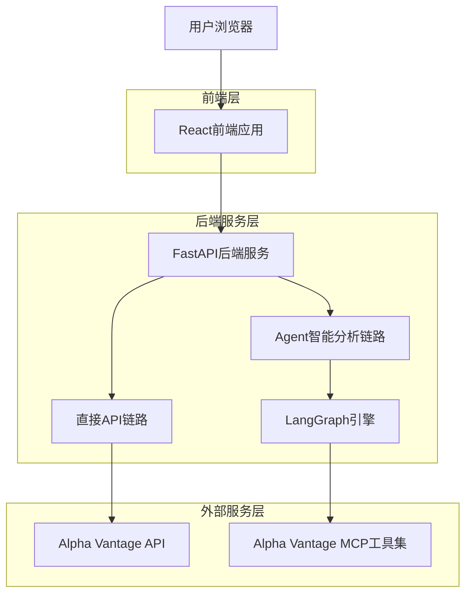
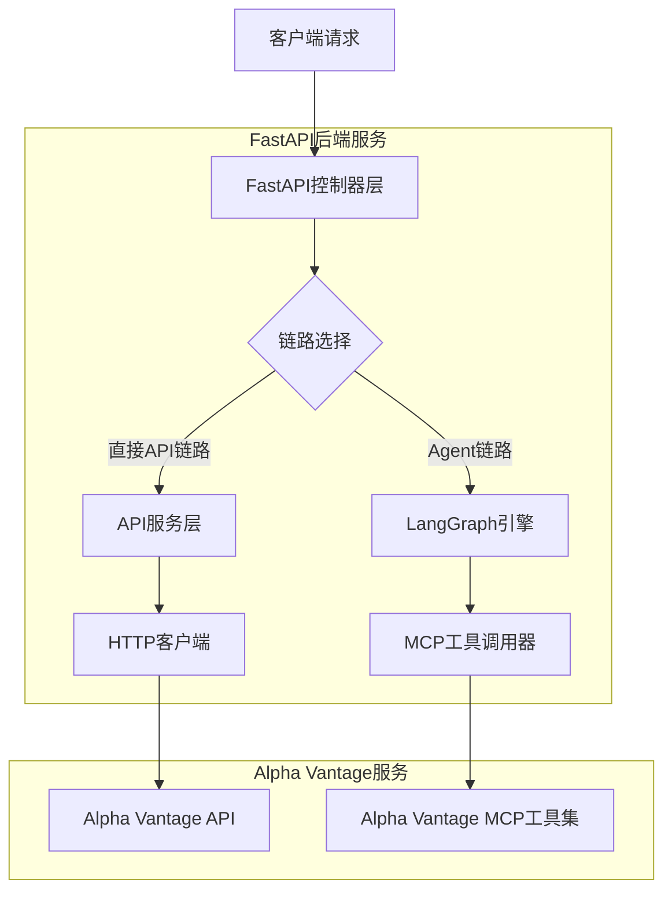
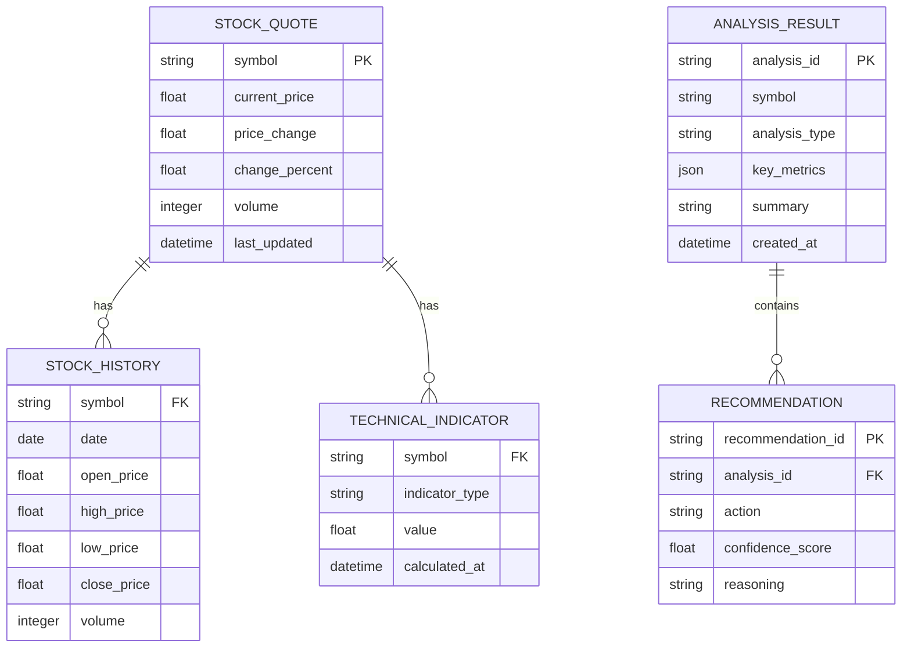

## 1. 架构设计



## 2. 技术描述

- 前端：React@18 + TypeScript + Axios
- 后端：FastAPI@0.104 + Python@3.11
- 智能引擎：LangGraph@0.1
- 数据源：Alpha Vantage API + Alpha Vantage MCP工具集

## 3. 路由定义

| 路由 | 用途 |
|-------|---------|
| /api/stocks/{symbol}/quote | 获取股票实时报价，直接API链路 |
| /api/stocks/{symbol}/history | 获取股票历史数据，直接API链路 |
| /api/stocks/{symbol}/indicators | 获取技术指标数据，直接API链路 |
| /api/analysis/{symbol} | 智能分析股票，Agent链路 |
| /api/analysis/compare | 多股票对比分析，Agent链路 |
| /api/analysis/recommendation | 投资建议生成，Agent链路 |

## 4. API定义

### 4.1 直接API链路接口

获取股票实时报价
```
GET /api/stocks/{symbol}/quote
```

响应参数：
| 参数名 | 参数类型 | 描述 |
|-----------|-------------|-------------|
| symbol | string | 股票代码 |
| price | float | 当前价格 |
| change | float | 价格变动 |
| volume | integer | 成交量 |
| timestamp | datetime | 数据时间戳 |

### 4.2 Agent智能分析链路接口

股票智能分析
```
POST /api/analysis/{symbol}
```

请求参数：
| 参数名 | 参数类型 | 是否必需 | 描述 |
|-----------|-------------|-------------|-------------|
| analysis_type | string | 是 | 分析类型：technical, fundamental, comprehensive |
| time_period | string | 否 | 分析周期：1d, 1w, 1m, 3m, 1y |

响应参数：
| 参数名 | 参数类型 | 描述 |
|-----------|-------------|-------------|
| symbol | string | 股票代码 |
| analysis_type | string | 分析类型 |
| summary | string | 分析摘要 |
| key_metrics | object | 关键指标 |
| recommendation | string | 投资建议 |
| confidence_score | float | 置信度评分 |

## 5. 服务器架构图



## 6. 数据模型

### 6.1 数据模型定义



### 6.2 核心服务实现

#### 直接API链路服务
```python
# 直接调用Alpha Vantage API
class DirectAPIService:
    def __init__(self, api_key: str):
        self.api_key = api_key
        self.base_url = "https://www.alphavantage.co/query"
    
    async def get_quote(self, symbol: str) -> StockQuote:
        """直接获取股票报价"""
        params = {
            "function": "GLOBAL_QUOTE",
            "symbol": symbol,
            "apikey": self.api_key
        }
        response = await httpx.get(self.base_url, params=params)
        return self._parse_quote(response.json())
    
    async def get_history(self, symbol: str, period: str) -> List[StockHistory]:
        """直接获取历史数据"""
        params = {
            "function": "TIME_SERIES_DAILY",
            "symbol": symbol,
            "apikey": self.api_key
        }
        response = await httpx.get(self.base_url, params=params)
        return self._parse_history(response.json())
```

#### Agent智能分析链路服务
```python
# LangGraph配置连接Alpha Vantage MCP
class AgentAnalysisService:
    def __init__(self, mcp_server_url: str):
        self.mcp_server_url = mcp_server_url
        self.graph = self._build_analysis_graph()
    
    def _build_analysis_graph(self) -> StateGraph:
        """构建分析图"""
        workflow = StateGraph(AnalysisState)
        
        # 添加节点
        workflow.add_node("data_collection", self._collect_data)
        workflow.add_node("technical_analysis", self._technical_analysis)
        workflow.add_node("fundamental_analysis", self._fundamental_analysis)
        workflow.add_node("synthesis", self._synthesize_recommendation)
        
        # 设置边
        workflow.add_edge("data_collection", "technical_analysis")
        workflow.add_edge("data_collection", "fundamental_analysis")
        workflow.add_edge("technical_analysis", "synthesis")
        workflow.add_edge("fundamental_analysis", "synthesis")
        
        workflow.set_entry_point("data_collection")
        
        return workflow.compile()
    
    async def analyze_stock(self, symbol: str, analysis_type: str) -> AnalysisResult:
        """执行智能分析"""
        initial_state = AnalysisState(
            symbol=symbol,
            analysis_type=analysis_type,
            mcp_tools=self._get_mcp_tools()
        )
        
        result = await self.graph.ainvoke(initial_state)
        return result["analysis_result"]
    
    def _get_mcp_tools(self) -> List[MCPTool]:
        """获取Alpha Vantage MCP工具"""
        return [
            MCPTool("stock_quote", self.mcp_server_url),
            MCPTool("technical_indicators", self.mcp_server_url),
            MCPTool("financial_statements", self.mcp_server_url),
            MCPTool("news_sentiment", self.mcp_server_url)
        ]
```

### 6.3 配置示例

```python
# 应用配置
APP_CONFIG = {
    "alpha_vantage": {
        "api_key": os.getenv("ALPHA_VANTAGE_API_KEY"),
        "base_url": "https://www.alphavantage.co/query",
        "mcp_server_url": os.getenv("ALPHA_VANTAGE_MCP_SERVER_URL")
    },
    "server": {
        "host": "0.0.0.0",
        "port": 8000,
        "debug": False
    }
}

# 链路选择策略
ROUTE_STRATEGY = {
    "/api/stocks/*/quote": "direct",
    "/api/stocks/*/history": "direct", 
    "/api/stocks/*/indicators": "direct",
    "/api/analysis/*": "agent",
    "/api/analysis/compare": "agent",
    "/api/analysis/recommendation": "agent"
}
```

## 7. 部署说明

该架构设计为无状态服务，可直接部署到：
- 传统服务器（通过Docker容器化）
- 云平台（AWS Lambda、Google Cloud Run等Serverless平台）
- 容器编排平台（Kubernetes）

无需额外的数据库或缓存服务，仅需确保网络能够访问Alpha Vantage API和MCP服务器即可。