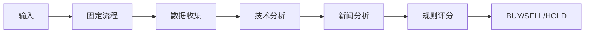
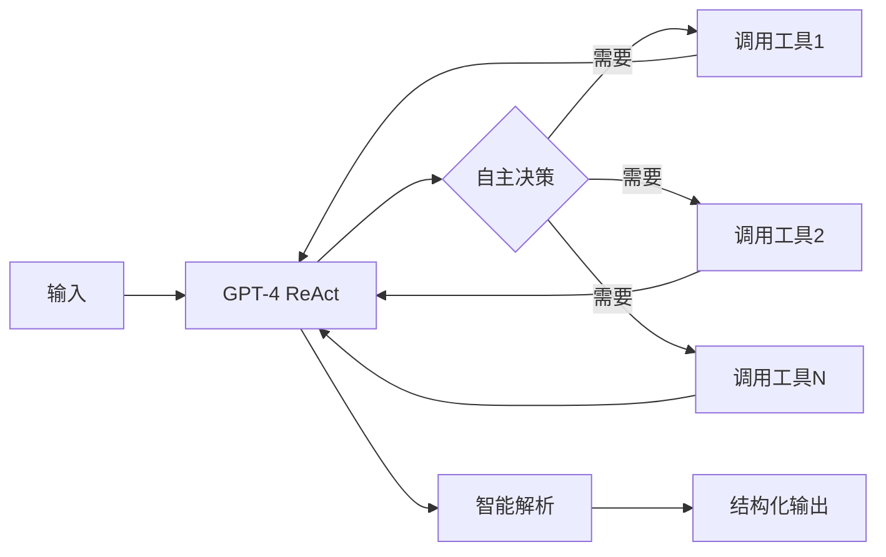

# 🤖 ReAct Agent 服务 - 替代 LangGraph

## ✨ 核心特性

✅ **完全兼容**：API 接口保持不变，前端无需修改  
✅ **智能决策**：使用 ReAct 模式，AI 自主调用工具  
✅ **自然语言**：GPT-4 生成专业分析报告  
✅ **Portfolio 支持**：考虑用户持仓的个性化建议  
✅ **异步执行**：完整的 async/await 支持  
✅ **Structlog 日志**：结构化日志记录  

## 📂 文件说明

```
backend/
├── react_agent_service.py          # ⭐ 新的 ReAct Agent 服务（单文件包含所有逻辑）
├── langgraph_service_backup.py     # 原 LangGraph 服务备份
├── main.py                          # FastAPI 入口（已更新导入）
├── requirements.txt                 # 依赖列表（已更新版本）
├── MIGRATION_GUIDE.md               # 详细迁移指南
└── test_agent.py                    # 测试脚本
```

## 🚀 快速开始

### 1. 安装依赖

```bash
cd backend
pip install -r requirements.txt
```

### 2. 配置环境变量

创建 `backend/.env` 文件：

```bash
# 必需
OPENAI_API_KEY=sk-your-key-here
ALPHA_VANTAGE_API_KEY=your-key-here

# 可选
OPENAI_MODEL=gpt-4-turbo-preview
OPENAI_TEMPERATURE=0
```

### 3. 启动服务

```bash
python main.py
```

访问 http://localhost:8000/docs 查看 API 文档。

## 🎯 使用示例

### 基础分析

```bash
curl -X POST http://localhost:8000/api/analysis/AAPL \
  -H "Content-Type: application/json" \
  -d '{"analysis_type": "comprehensive"}'
```

### 带持仓分析

```bash
curl -X POST http://localhost:8000/api/analysis/AAPL \
  -H "Content-Type: application/json" \
  -d '{
    "analysis_type": "comprehensive",
    "portfolio": {
      "positions": {
        "AAPL": {"shares": 100, "avg_cost": 150.0}
      },
      "total_value": 50000
    }
  }'
```

## 📊 架构对比

### 之前（LangGraph）



### 现在（ReAct Agent）



## 🔧 核心组件

### 1. Agent 核心
- **类**：`StockAnalysisAgent`
- **方法**：`analyze_stock(symbol, analysis_type, portfolio)`
- **模式**：ReAct (Reasoning + Acting)

### 2. 工具集（4个）
- `get_stock_price`: 实时价格
- `get_news`: 新闻情感
- `calculate_indicators`: 技术指标
- `get_company_info`: 基本面

### 3. 智能解析器
- **类**：`ResultParser`
- **功能**：从自然语言提取 BUY/SELL/HOLD
- **方法**：关键词匹配 + 正则表达式

### 4. 配置管理
- **类**：`AgentConfig`
- **环境变量**：自动加载 .env
- **验证**：启动时检查必需配置

## 📝 日志

### 控制台日志
使用 `structlog`，结构化输出：
```python
logger.info("股票分析完成", symbol="AAPL", recommendation="BUY")
```

### 对话历史
自动保存到：
```
backend/logs/conversations/{SYMBOL}_{TIMESTAMP}.json
```

## 🎨 自定义

### 调整 Agent 行为

修改 `react_agent_service.py` 中的 `_create_prompt()` 方法：

```python
system_message = """你是一位专业的股票分析师...
# 在这里修改系统提示词
"""
```

### 添加新工具

```python
@tool
def your_new_tool(param: str) -> str:
    """工具描述"""
    # 实现逻辑
    return result

# 在 get_all_tools() 中添加
def get_all_tools():
    return [
        get_stock_price,
        get_news,
        calculate_indicators,
        get_company_info,
        your_new_tool  # 新工具
    ]
```

### 调整解析规则

修改 `ResultParser._parse_recommendation()` 方法：

```python
def _parse_recommendation(self, text: str) -> str:
    # 添加更多关键词
    buy_keywords = ['买入', 'buy', '强烈推荐', ...]
    # ...
```

## ⚡ 性能优化

- **并发**：使用 `asyncio.to_thread()` 避免阻塞
- **缓存**：可添加工具结果缓存（待实现）
- **超时**：Agent 最多执行 10 步
- **日志级别**：生产环境建议关闭 `verbose=True`

## 🐛 故障排除

### 问题1：导入错误
```bash
# 解决方案
cd backend
pip install -r requirements.txt
```

### 问题2：API Key 错误
```bash
# 检查 .env 文件
cat .env

# 确保包含
OPENAI_API_KEY=...
ALPHA_VANTAGE_API_KEY=...
```

### 问题3：响应慢
- 正常现象，ReAct 模式需要多次 LLM 调用
- 可考虑使用 `gpt-3.5-turbo` 提速（牺牲质量）

### 问题4：解析错误
- Agent 输出不规范时可能解析失败
- 默认返回 `HOLD`，置信度 `0.70`

## 🔄 回滚到 LangGraph

如果需要恢复：

1. 修改 `main.py`：
```python
from backend.langgraph_service_backup import stock_analysis_agent
```

2. 恢复依赖：
```bash
pip install langgraph==0.0.40 langchain==0.0.350
```

## 📚 参考资料

- [LangChain ReAct Agent](https://python.langchain.com/docs/modules/agents/agent_types/react)
- [OpenAI Function Calling](https://platform.openai.com/docs/guides/function-calling)
- [Alpha Vantage API](https://www.alphavantage.co/documentation/)

---

**作者**：基于原 agent/ 目录代码改造  
**版本**：v1.0.0  
**日期**：2024-11-15  

